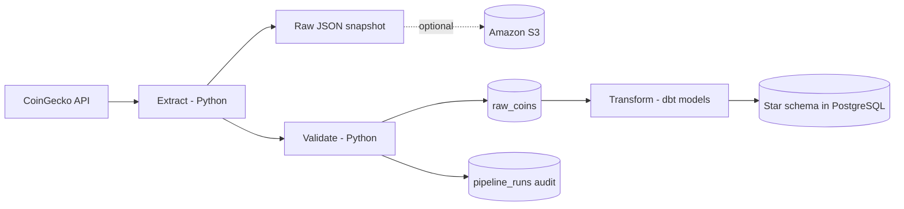
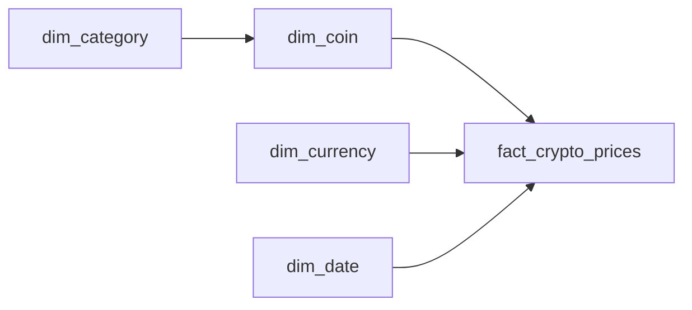

# Crypto Market ELT

A containerized **ELT** pipeline for cryptocurrency market data. Python handles
ingestion — it extracts from the CoinGecko API, validates data quality, and loads
the raw records into PostgreSQL — while **dbt** transforms those raw records into a
star schema with SQL, and **Apache Airflow** orchestrates the whole thing on an
hourly schedule. The raw API response is also preserved as an immutable JSON
snapshot, optionally uploaded to Amazon S3.

> **ELT, not ETL:** the raw data is loaded *before* it is transformed. Python never
> reshapes the data; it only extracts, gates on quality, and loads. All
> transformation lives in dbt (versioned SQL models with tests and lineage), which
> means the raw layer is always available to re-transform without re-hitting the API.

## Architecture



Apache Airflow runs the pipeline hourly as a four-task DAG:

```text
apply_migrations → run_python_etl → dbt_run → dbt_test
```

## Pipeline flow

**Ingestion (Python, `main.py`):**

1. `main.py` creates a unique pipeline run ID and UTC start time.
2. Pending SQL migrations are applied (creating `pipeline_runs` and `raw_coins`).
3. A `running` record is created in the pipeline audit table.
4. Market data is requested from CoinGecko.
5. The original API response is saved as an immutable raw JSON snapshot.
6. Records are validated; the run fails if fewer than `MIN_VALID_RECORDS` pass.
7. The raw records are loaded into `raw_coins`, the source table dbt reads.
8. The audit record is updated to `succeeded` or `failed`.

**Transformation (dbt):**

9. `stg_raw_coins` cleans and type-casts the raw rows.
10. `dim_category`, `dim_coin`, `dim_currency`, and `dim_date` build the dimensions.
11. `fact_crypto_prices` builds the fact table from staging joined to the dimensions.
12. `dbt test` asserts uniqueness, not-null, relationship, and combination tests.

Python owns steps 1–8; dbt owns 9–12. The two meet at the `raw_coins` table. Under
Airflow the ingestion runs as `run_python_etl` and dbt runs as `dbt_run` / `dbt_test`.
See [`AIRFLOW.md`](AIRFLOW.md) and [`dbt/README.md`](dbt/README.md).

## Data model

dbt builds the star schema into the `public` schema. `pipeline_runs` is written by
Python and holds the audit trail; the fact table carries the `pipeline_run_id` of
the ingestion run that produced its rows.



| Table | Owner | Purpose |
| --- | --- | --- |
| `raw_coins` | Python | Raw API records; the source table dbt reads |
| `dim_category` | dbt | Cryptocurrency analysis categories |
| `dim_coin` | dbt | Coin ID, name, symbol, and category |
| `dim_currency` | dbt | Configured reporting currency |
| `dim_date` | dbt | Hourly UTC calendar values |
| `fact_crypto_prices` | dbt | Price, market cap, volume, 24-hour values, and timestamps |
| `pipeline_runs` | Python | Run status, counts, timestamps, and errors |

The fact-table grain is one coin, in one reporting currency, at one exact source observation timestamp. The deterministic fact key, built by the dbt fact model, is:

```text
<coin-id>_<currency-code>_<observed-at-utc>
```

For example, `bitcoin_usd_20250720T100000000000Z`. The key is deterministic, so the same observation always maps to the same `price_id` — reprocessing produces identical keys rather than duplicates.

## Data storage

The raw API response is saved as an immutable snapshot, partitioned by the UTC pipeline start date and hour:

```text
data/raw/run_date=YYYY-MM-DD/run_hour=HH/<pipeline-run-id>.json
```

When S3 is enabled, the same partition structure is stored under the `raw/` object prefix. Transformed data is not snapshotted to files — it lives in the PostgreSQL star schema that dbt builds, and the raw snapshot plus `raw_coins` are enough to rebuild it at any time.

## Data-quality rules

Records are rejected for missing or null fields, invalid identifiers, duplicate coin IDs, incorrect or non-finite numeric values, non-positive market measures, invalid timestamps, or a 24-hour high below the low. `MIN_VALID_RECORDS` defines the minimum valid record count required to continue.

## Repository structure

```text
Crypto_ETL/
├── .github/workflows/ci.yml    # Continuous integration
├── config/                     # Environment and coin configuration
├── dags/                       # Airflow DAG definition
├── dbt/                        # dbt transformation layer and tests
├── docs/                       # Example analytical SQL
├── etl/                        # Extract, validate, load (raw), and migrations
├── init/                       # PostgreSQL initialization
├── migrations/                 # Versioned warehouse migrations
├── tests/                      # Automated tests and fixtures
├── docker-compose.yml          # Airflow and PostgreSQL services
├── Dockerfile                  # Python application image
├── Dockerfile.airflow          # Airflow image with the ETL project and dbt
├── main.py                     # Pipeline entry point
├── requirements.txt            # Runtime dependencies
└── requirements-dev.txt        # Development dependencies
```

## Configuration

Copy `.env.example` to `.env` and set a strong database password.

| Variable | Default | Purpose |
| --- | --- | --- |
| `DB_USER` | `postgres` | PostgreSQL user |
| `DB_PASSWORD` | Required by Docker Compose | PostgreSQL password |
| `DB_NAME` | `crypto_etl` | PostgreSQL database |
| `POSTGRES_PORT` | `5432` | PostgreSQL host port |
| `CURRENCY` | `usd` | CoinGecko reporting currency |
| `MIN_VALID_RECORDS` | `1` | Minimum accepted record count |
| `S3_ENABLED` | `false` | Enables S3 uploads |
| `S3_BUCKET_NAME` | Empty | Destination S3 bucket |
| `AWS_DEFAULT_REGION` | `ap-south-1` | AWS region |
| `LOG_LEVEL` | `INFO` | Application logging level |

`.env`, generated data, log files, and AWS credentials must not be committed.

## Running the project

Create the environment file and set `DB_PASSWORD`:

```bash
cp .env.example .env
```

Run the application with PostgreSQL:

```bash
docker compose up --build
```

For a direct Python run, install dependencies:

```bash
python -m pip install -r requirements-dev.txt
```

Run locally without PostgreSQL or S3:

```bash
python main.py --skip-postgres --skip-s3
```

Use `--run-at` for a reproducible, timezone-aware timestamp:

```bash
python main.py --run-at 2025-07-20T10:00:00Z --skip-postgres --skip-s3
```

Stop Docker services with `docker compose down`.

## Code Quality Improvements

Recent improvements to the codebase include:
- Added type hints to all functions for better code maintainability and IDE support
- Fixed inconsistent spacing in the validation module's `REQUIRED_FIELDS` list
- Enhanced code documentation and readability

## Testing

```bash
python -m pytest -q
python -m ruff check .
```

GitHub Actions runs linting and tests on pushes to `main` and on pull requests.

## Example analysis

[`docs/analysis_queries.sql`](docs/analysis_queries.sql) contains examples for:

- End-of-day market cap and volume by category
- Largest 24-hour price movements in the latest successful batch
- Pipeline reliability and rejected-record trends
