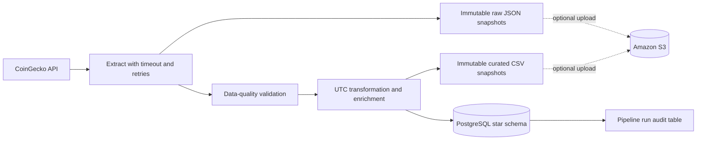

# Crypto Market ETL

A containerized Python ETL pipeline that captures cryptocurrency market snapshots from the CoinGecko API, validates and enriches the data, stores replayable files, and loads an analytics-ready PostgreSQL star schema.

## Why this project exists

The project demonstrates the concerns that make a data pipeline useful beyond a one-off script: source resilience, data quality, idempotent loading, historical retention, schema evolution, lineage, automated tests, and reproducible local deployment.

## Architecture



## Data model

The fact-table grain is **one coin, currency, and source observation timestamp**. `price_id` is deterministic from the CoinGecko coin ID and the exact UTC `observed_at` value, making reruns idempotent without overwriting later observations.

| Table | Purpose |
| --- | --- |
| `fact_crypto_prices` | Market price, market cap, volume, 24-hour high/low, source observation time, ingestion time, and pipeline run ID |
| `dim_coin` | CoinGecko coin ID, name, symbol, and curated category |
| `dim_category` | Analysis category such as DeFi, Layer 2, or Stablecoin |
| `dim_date` | Hourly UTC calendar dimension used by both source and ingestion timestamps |
| `dim_currency` | Reporting currency dimension |
| `pipeline_runs` | Execution status, counts, timestamps, and error message for lineage and operational monitoring |

Versioned migrations in `migrations/` manage schema creation and upgrades. They are applied before each database load.

## Quick start

1. Copy `.env.example` to `.env` and replace `DB_PASSWORD` with a strong local password.
2. Start the database and run the pipeline:
   ```bash
   docker compose up --build
   ```
3. Run a deterministic local-only execution without PostgreSQL or S3:
   ```bash
   python main.py --run-at 2025-07-20T10:00:00Z --skip-postgres --skip-s3
   ```
4. Stop the local stack when finished:
   ```bash
   docker compose down
   ```

Local snapshots are intentionally partitioned by run date and hour:

```text
data/raw/run_date=YYYY-MM-DD/run_hour=HH/<pipeline-run-id>.json
data/curated/run_date=YYYY-MM-DD/run_hour=HH/<pipeline-run-id>.csv
```

## S3 configuration

S3 is disabled by default so a local run does not require cloud credentials. To enable it, set `S3_ENABLED=true`, set `S3_BUCKET_NAME`, and provide AWS credentials through the normal AWS credential chain, such as a named profile, IAM role, or CI secret. Never commit AWS access keys or `.env`.

## Data-quality rules

Records are rejected when they have missing fields, null values, invalid identifiers, duplicate coin IDs, non-finite numbers, invalid timestamps, non-positive market measures, or a 24-hour high below the low. Set `MIN_VALID_RECORDS` to enforce a source completeness threshold in production.

## Development

```bash
pip install -r requirements-dev.txt
pytest -q
ruff check .
```

GitHub Actions runs linting and tests on pushes to `main` and pull requests.

## Example analysis

See [`docs/analysis_queries.sql`](docs/analysis_queries.sql) for category market-cap analysis, largest daily moves, and pipeline reliability reporting.

## Interview talking points

- I modeled the warehouse at an explicit fact grain and retained both source observation and ingestion timestamps.
- Raw source payloads are preserved independently from the curated model, enabling replay when business logic changes.
- A deterministic fact key makes warehouse loads idempotent while preserving time-series history.
- Database loads use bulk upserts in one transaction, so failed batches do not leave partial dimension/fact writes.
- Every run is auditable through `pipeline_runs`, including counts and failure messages.
- Schema evolution is versioned through SQL migrations rather than relying on container initialization alone.

## Next production steps

For a deployed environment, run this command in an orchestrator such as Prefect, Airflow, or Dagster, emit metrics to a monitoring platform, write curated data as Parquet for large-scale lake analytics, and use IAM roles plus a managed secrets service.
