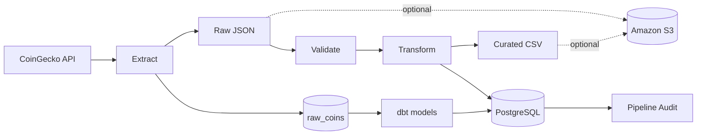
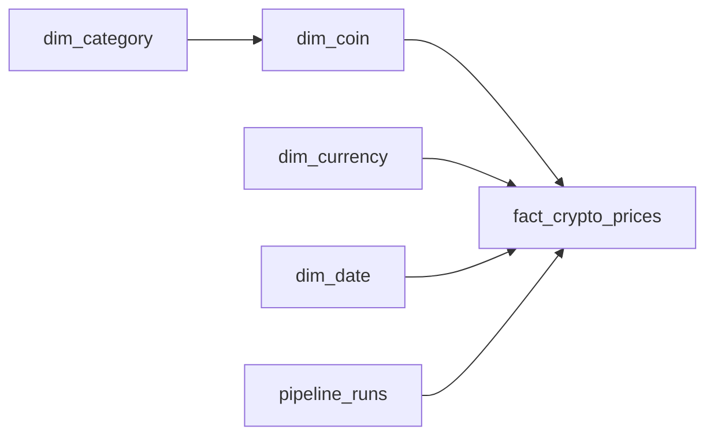

# Crypto Market ETL

A containerized batch ETL pipeline that extracts cryptocurrency market data from the CoinGecko API, validates and transforms the records, stores raw and curated snapshots, and loads a PostgreSQL star schema. Snapshot files can optionally be uploaded to Amazon S3.

## Architecture



Apache Airflow schedules the pipeline hourly and runs `dbt run` and `dbt test`
after the Python ETL completes.

## Pipeline flow

1. `main.py` creates a unique pipeline run ID and UTC start time.
2. Pending SQL migrations are applied when PostgreSQL loading is enabled.
3. A `running` record is created in the pipeline audit table.
4. Market data is requested from CoinGecko.
5. The original API response is saved as a raw JSON snapshot.
6. The raw records are loaded into `raw_coins`, the source table for dbt.
7. Invalid records are rejected using the configured data-quality rules.
8. Valid records are transformed into dimension and fact DataFrames.
9. The transformed fact data is saved as a curated CSV snapshot.
10. Dimensions and facts are upserted into PostgreSQL in one transaction.
11. The audit record is updated to `succeeded` or `failed`.

Under Airflow the same `run_pipeline()` function runs as one task, followed by
`dbt run` and `dbt test`. See [`AIRFLOW.md`](AIRFLOW.md) and
[`dbt/README.md`](dbt/README.md).

## Data model



| Table | Purpose |
| --- | --- |
| `dim_category` | Cryptocurrency analysis categories |
| `dim_coin` | Coin ID, name, symbol, and category |
| `dim_currency` | Configured reporting currency |
| `dim_date` | Hourly UTC calendar values |
| `fact_crypto_prices` | Price, market cap, volume, 24-hour values, and timestamps |
| `pipeline_runs` | Run status, counts, timestamps, and errors |

The fact-table grain is one coin, in one reporting currency, at one exact source observation timestamp. The deterministic fact key is:

```text
<coin-id>_<currency-code>_<observed-at-utc>
```

For example, `bitcoin_usd_20250720T100000000000Z`. Reprocessing the same observation generates the same key, so PostgreSQL updates the existing row instead of inserting a duplicate.

## Data storage

Snapshots are partitioned by the UTC pipeline start date and hour:

```text
data/raw/run_date=YYYY-MM-DD/run_hour=HH/<pipeline-run-id>.json
data/curated/run_date=YYYY-MM-DD/run_hour=HH/<pipeline-run-id>.csv
```

When S3 is enabled, the same partition structure is stored under `raw/` and `curated/` object prefixes.

## Data-quality rules

Records are rejected for missing or null fields, invalid identifiers, duplicate coin IDs, incorrect or non-finite numeric values, non-positive market measures, invalid timestamps, or a 24-hour high below the low. `MIN_VALID_RECORDS` defines the minimum valid record count required to continue.

## Repository structure

```text
Crypto_ETL/
├── .github/workflows/ci.yml    # Continuous integration
├── config/                     # Environment and coin configuration
├── dags/                       # Airflow DAG definition
├── dbt/                        # dbt transformation layer and tests
├── docs/                       # Example analytical SQL
├── etl/                        # Extract, validate, transform, load, and migrations
├── init/                       # PostgreSQL initialization
├── migrations/                 # Versioned warehouse migrations
├── tests/                      # Automated tests and fixtures
├── docker-compose.yml          # Airflow and PostgreSQL services
├── Dockerfile                  # Python application image
├── Dockerfile.airflow          # Airflow image with the ETL project and dbt
├── main.py                     # Pipeline entry point
├── requirements.txt            # Runtime dependencies
└── requirements-dev.txt        # Development dependencies
```

## Configuration

Copy `.env.example` to `.env` and set a strong database password.

| Variable | Default | Purpose |
| --- | --- | --- |
| `DB_USER` | `postgres` | PostgreSQL user |
| `DB_PASSWORD` | Required by Docker Compose | PostgreSQL password |
| `DB_NAME` | `crypto_etl` | PostgreSQL database |
| `POSTGRES_PORT` | `5432` | PostgreSQL host port |
| `CURRENCY` | `usd` | CoinGecko reporting currency |
| `MIN_VALID_RECORDS` | `1` | Minimum accepted record count |
| `S3_ENABLED` | `false` | Enables S3 uploads |
| `S3_BUCKET_NAME` | Empty | Destination S3 bucket |
| `AWS_DEFAULT_REGION` | `ap-south-1` | AWS region |
| `LOG_LEVEL` | `INFO` | Application logging level |

`.env`, generated data, log files, and AWS credentials must not be committed.

## Running the project

Create the environment file and set `DB_PASSWORD`:

```bash
cp .env.example .env
```

Run the application with PostgreSQL:

```bash
docker compose up --build
```

For a direct Python run, install dependencies:

```bash
python -m pip install -r requirements-dev.txt
```

Run locally without PostgreSQL or S3:

```bash
python main.py --skip-postgres --skip-s3
```

Use `--run-at` for a reproducible, timezone-aware timestamp:

```bash
python main.py --run-at 2025-07-20T10:00:00Z --skip-postgres --skip-s3
```

Stop Docker services with `docker compose down`.

## Testing

```bash
python -m pytest -q
python -m ruff check .
```

GitHub Actions runs linting and tests on pushes to `main` and on pull requests.

## Example analysis

[`docs/analysis_queries.sql`](docs/analysis_queries.sql) contains examples for:

- End-of-day market cap and volume by category
- Largest 24-hour price movements in the latest successful batch
- Pipeline reliability and rejected-record trends
